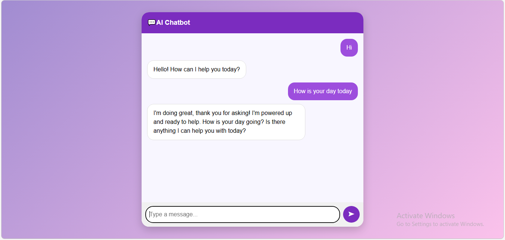

# 🤖 AI Chatbot using Flask & Gemini API

A modern AI-powered chatbot built using Flask and Google Gemini API.
This application provides real-time conversational responses through a clean, responsive, and interactive web interface.

---

## 🚀 Features

* 💬 Real-time AI chat responses
* ⚡ Powered by Google Gemini (latest models)
* 🎨 Modern and responsive UI (Bootstrap + custom styling)
* 🔄 Typing animation for better user experience
* 🌐 Easy deployment (Render / Railway)
* 🧩 Lightweight and simple Flask backend

---

## 🛠️ Tech Stack

* **Backend:** Flask (Python)
* **AI Model:** Google Gemini API
* **Frontend:** HTML, CSS, Bootstrap, jQuery
* **Deployment:** Render / Railway

---

## 📂 Project Structure

```
ChatBot/
│
├── app.py
├── requirements.txt
├── templates/
│   └── chat.html
├── .env (not included in repo)
└── README.md
```

---

## ⚙️ Installation & Setup

### 1️⃣ Clone the Repository

```bash
git clone https://github.com/Siri2156/chatbot.git
cd chatbot
```

---

### 2️⃣ Create Virtual Environment

```bash
python -m venv .venv
```

Activate environment:

* **Windows**

```bash
.venv\Scripts\activate
```

* **Mac/Linux**

```bash
source .venv/bin/activate
```

---

### 3️⃣ Install Dependencies

```bash
pip install -r requirements.txt
```

---

### 4️⃣ Configure Environment Variables

Create a `.env` file in the root directory:

```
GEMINI_API_KEY=your_api_key_here
```

---

### 5️⃣ Run the Application

```bash
python app.py
```

Open your browser:

```
http://127.0.0.1:5000
```

---

## 🌐 Deployment

You can deploy this chatbot easily on:

* Render
* Railway

### Steps:

1. Push code to GitHub
2. Connect repository to deployment platform
3. Add environment variable:

```
GEMINI_API_KEY=your_api_key
```

4. Deploy 🚀

---

## 🔐 Security Note

* Never expose your API key in the code
* Always use environment variables (`.env`)
* Add `.env` to `.gitignore`

---

## 📸 Screenshot


---

## 💡 Future Improvements

* 🧠 Add chat history (database integration)
* 👤 User authentication system
* 🌍 Multi-user support
* ⚡ Streaming responses (real-time typing effect)
* 📱 Mobile app version

---

## 👨‍💻 Author

GitHub: https://github.com/Siri2156

---

## ⭐ Support

If you like this project, give it a ⭐ on GitHub!
